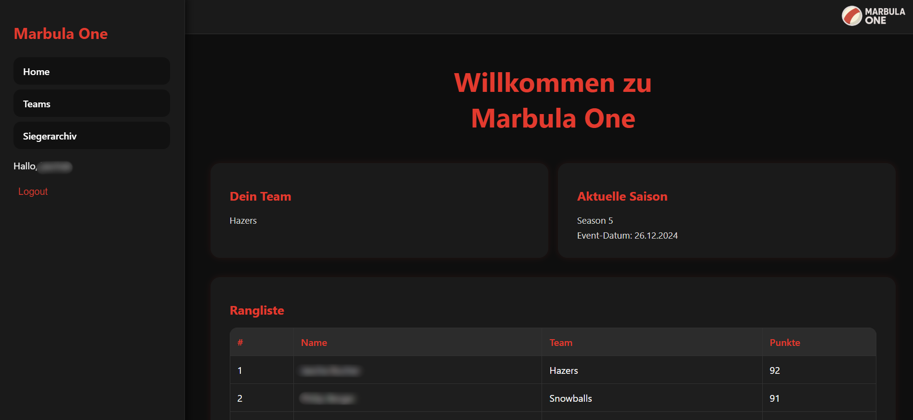
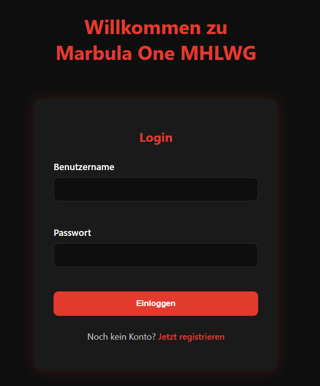
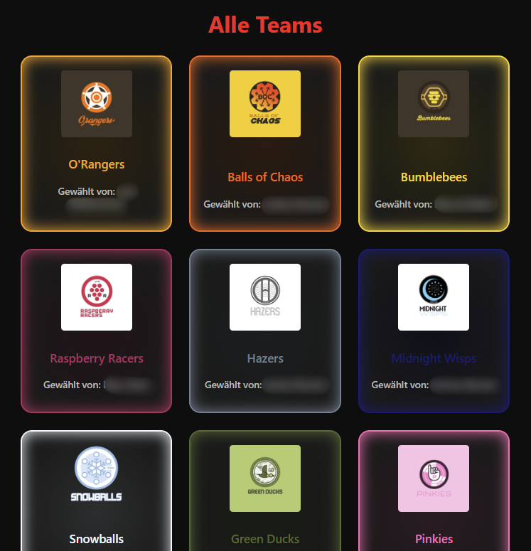
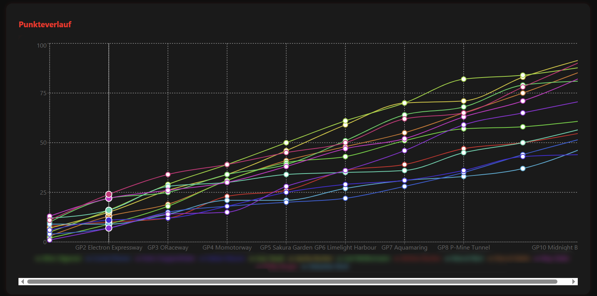

# Marbula One App

Webapp für ein jährliches Freundes-Event rund um Marbula One.
Die Anwendung verwaltet Seasons, Teams, Rennen, Punkte, Gewinner und Benutzerrollen.

## Vorschau



## Features

- Login und Registrierung mit `username`, `realname`, `password`
- Rollenbasiertes System (`admin`, `user`)
- Teamwahl pro Season (inkl. Team-Eindeutigkeit innerhalb einer Season)
- Teamwahl nur für Benutzer, die in der aktuellen Season als Teilnehmer hinterlegt sind
- Seasons verwalten (anlegen, als aktuell setzen, löschen)
- Rennen pro Season verwalten und Resultate mit Punkten erfassen
- Rangliste, Ergebnistabelle und Punkteverlauf auf der Startseite
- Gewinnerverwaltung (Archiv)
- Admin-Bereich für Teams, Seasons, Rennen, Resultate, Gewinner und Benutzer
- Toast-Meldungen in den Admin-Bereichen für Erfolg/Fehler/Hinweise

## Wichtige Integritätsregeln

- Ein Team kann in einer Season nur einmal vergeben werden.
- Benutzer können nicht gelöscht werden, wenn sie bereits Resultate in bestehenden Seasons haben.
- Der letzte Admin kann nicht gelöscht werden.
- Ein Admin kann sich nicht selbst löschen.
- Beim Löschen einer Season werden zugehörige Rennen und Teamzuweisungen mitgelöscht.
- Wenn die aktuelle Season gelöscht wird, wird automatisch eine andere Season als neue aktuelle Season gesetzt (falls vorhanden).

## Tech Stack

### Backend

- Node.js
- Express 5
- MongoDB + Mongoose
- JWT (`jsonwebtoken`)
- `bcryptjs`

### Frontend

- React 19
- React Router
- Axios
- Recharts
- CSS (ohne UI Framework im Hauptfrontend)

## Projektstruktur

```text
marbula-one-app/
|-- backend/
|   |-- config/
|   |-- controllers/
|   |-- middleware/
|   |-- models/
|   |-- routes/
|   |-- utils/
|   `-- server.js
|-- frontend/
|   |-- public/
|   `-- src/
|       |-- components/
|       |-- context/
|       |-- layouts/
|       |-- pages/
|       `-- styles/
|-- screenshots/
`-- README.md
```

## Lokales Setup

### Voraussetzungen

- Node.js + npm
- MongoDB (Atlas oder lokal)

### 1) Repository klonen

```bash
git clone <dein-repo-url>
cd marbula-one-app
```

### 2) Backend einrichten

```bash
cd backend
npm install
```

`backend/.env` erstellen:

```env
MONGO_URI=<deine_mongodb_connection_string>
JWT_SECRET=<dein_geheimes_jwt_secret>
PORT=5000
```

Backend starten:

```bash
npm run dev
```

### 3) Frontend einrichten

In neuem Terminal:

```bash
cd frontend
npm install
```

`frontend/.env` erstellen:

```env
REACT_APP_API_URL=http://localhost:5000/api
```

Frontend starten:

```bash
npm start
```

### 4) App aufrufen

- Frontend: `http://localhost:3000`
- Backend: `http://localhost:5000`

## Build

```bash
cd frontend
npm run build
```

## Rollen und Rechte

| Rolle   | Rechte                                                                                  |
| ------- | --------------------------------------------------------------------------------------- |
| `admin` | Voller Zugriff auf Admin-Seiten (Teams, Seasons, Rennen, Resultate, Gewinner, Benutzer) |
| `user`  | Team wählen (falls Season-Teilnehmer), Ranglisten/Resultate/Verlauf ansehen             |

## API Übersicht (Kurzform)

### Auth

- `POST /api/auth/register`
- `POST /api/auth/login`
- `GET /api/auth/me`

### Users

- `POST /api/users` (admin)
- `GET /api/users` (admin)
- `GET /api/users/me`
- `GET /api/users/:id` (admin oder selbst)
- `PUT /api/users/:id/name` (admin)
- `PUT /api/users/:id/password` (admin oder selbst)
- `PUT /api/users/:id/role` (admin)
- `DELETE /api/users/:id` (admin)

### Seasons

- `GET /api/seasons`
- `POST /api/seasons` (admin)
- `DELETE /api/seasons/:id` (admin)
- `PUT /api/seasons/:id/set-current` (admin)
- `GET /api/seasons/current`

### Races

- `GET /api/races/season/:seasonId`
- `POST /api/races/season/:seasonId` (admin)
- `GET /api/races/:raceId`
- `PUT /api/races/:raceId/results` (admin)
- `DELETE /api/races/:id` (admin)

### Teams

- `GET /api/teams`
- `GET /api/teams/:id`
- `GET /api/teams/:id/seasons`
- `POST /api/teams` (admin)
- `PUT /api/teams/:id` (admin)
- `DELETE /api/teams/:id` (admin)

### User-Season-Team

- `GET /api/userSeasonTeams?season=<seasonId>`
- `GET /api/userSeasonTeams/user/:userId`
- `POST /api/userSeasonTeams`
- `DELETE /api/userSeasonTeams`

### Winners

- `GET /api/winners`
- `POST /api/winners`
- `PUT /api/winners/:id`
- `DELETE /api/winners/:id`

## Screenshots




